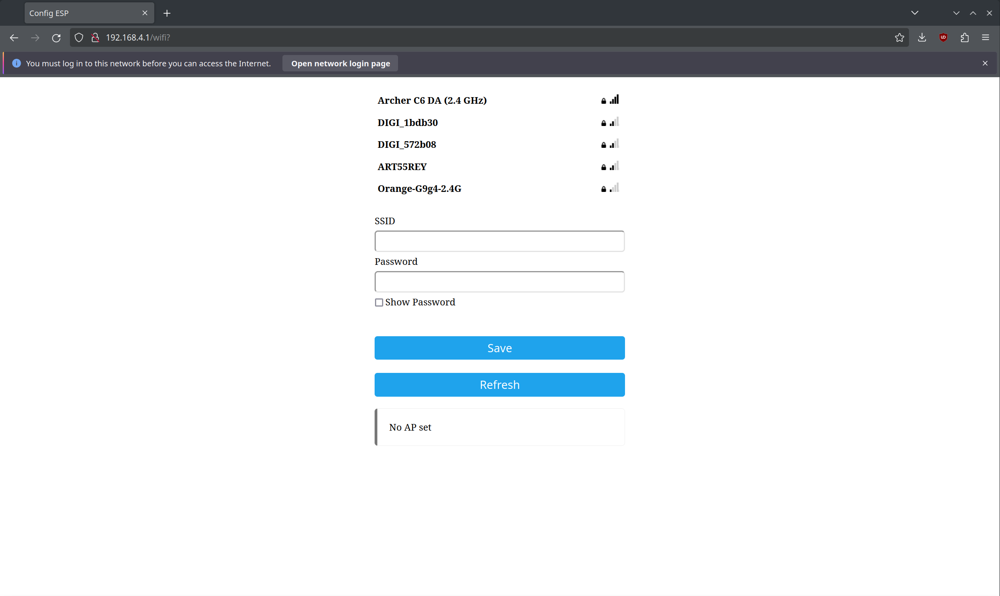
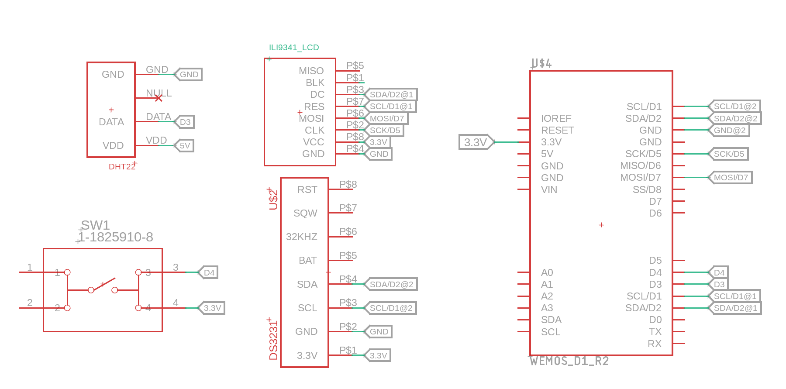

# Smart mirror

Code for an IoT ESP8286 based smart mirror that displays the following
information:

* current time and date
* weather (and whether you need a jacket or not)
* room humidity (and if it's optimal given the outside temperature)

It also features a simple way of connecting to a wireless network through a
mobile phone by using an access point opened by the mirror which allows access
to a connection portal:

Schematic:

Here's a picture of the finished product:

The effect is achieved by placing a display behind a makeshift one-way/two-way
mirror which allows light to go through it.

And a short [demo](https://www.youtube.com/watch?v=awK3mPZTxls)!
