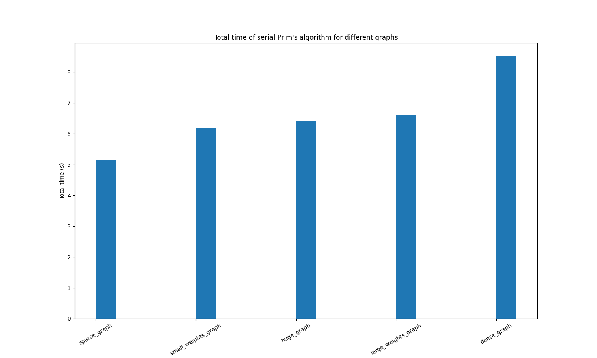
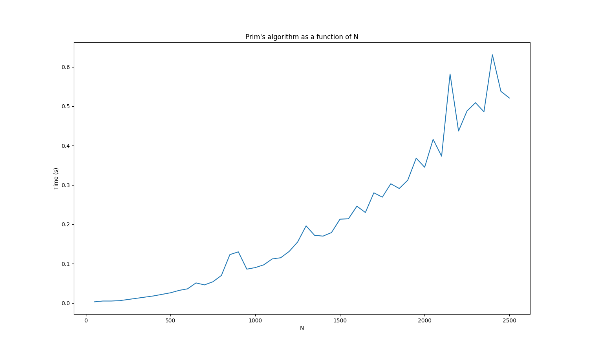
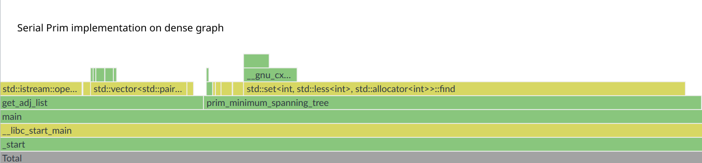
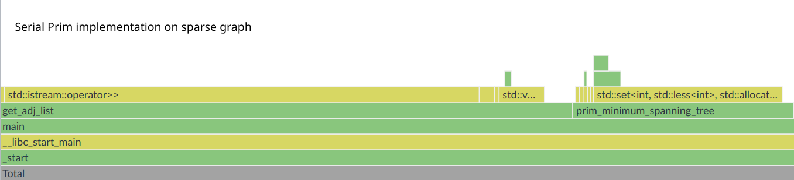
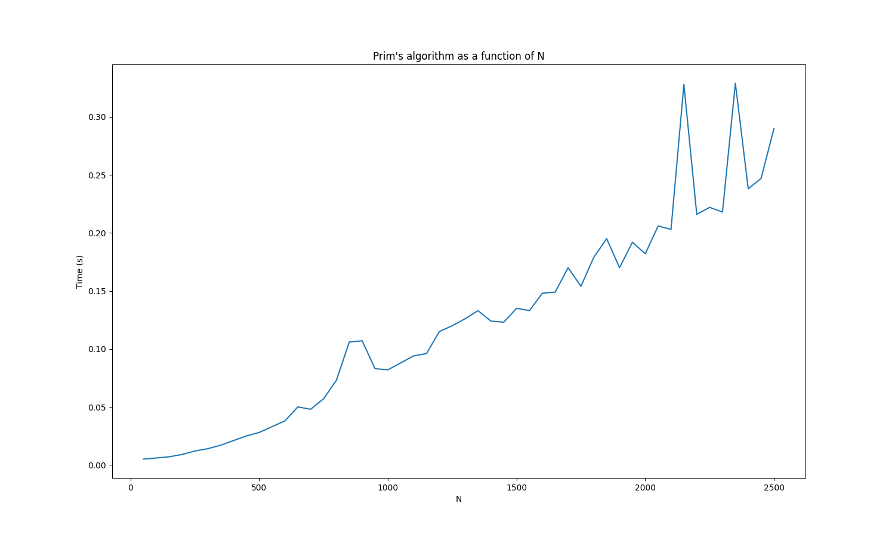
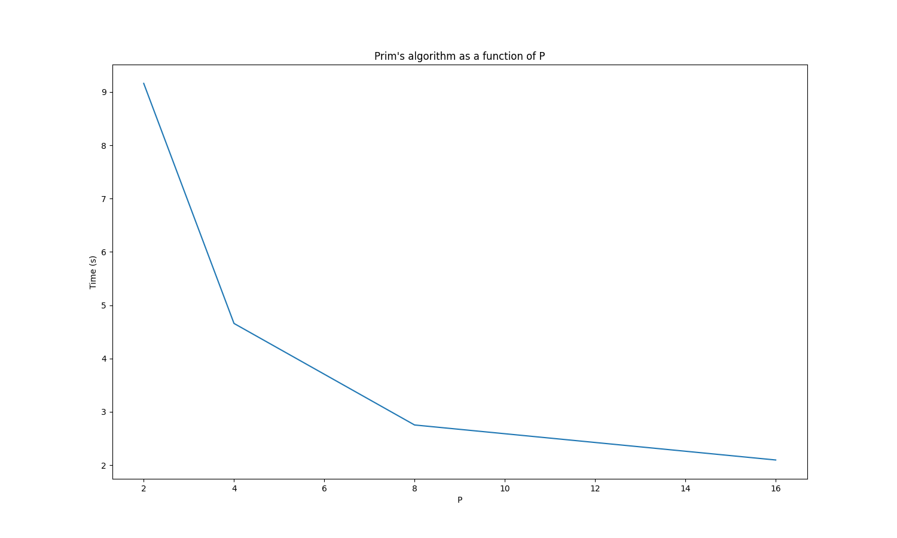
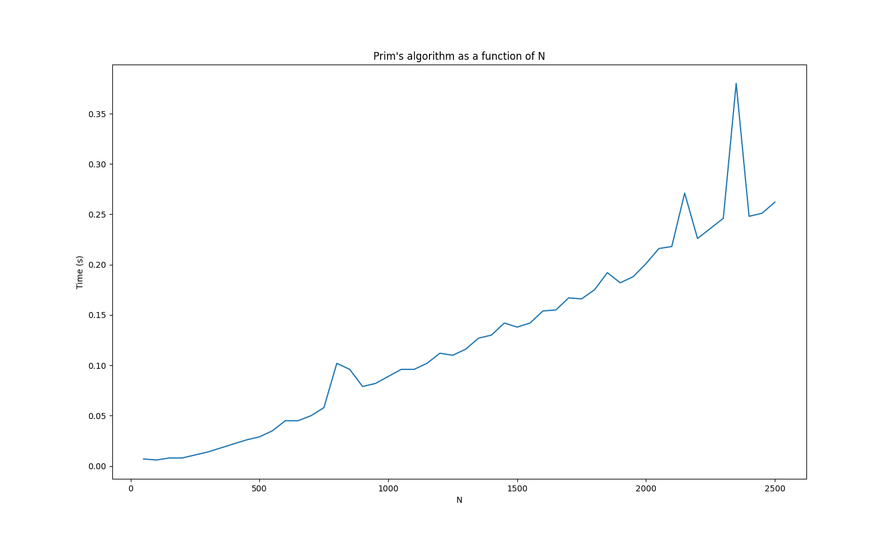
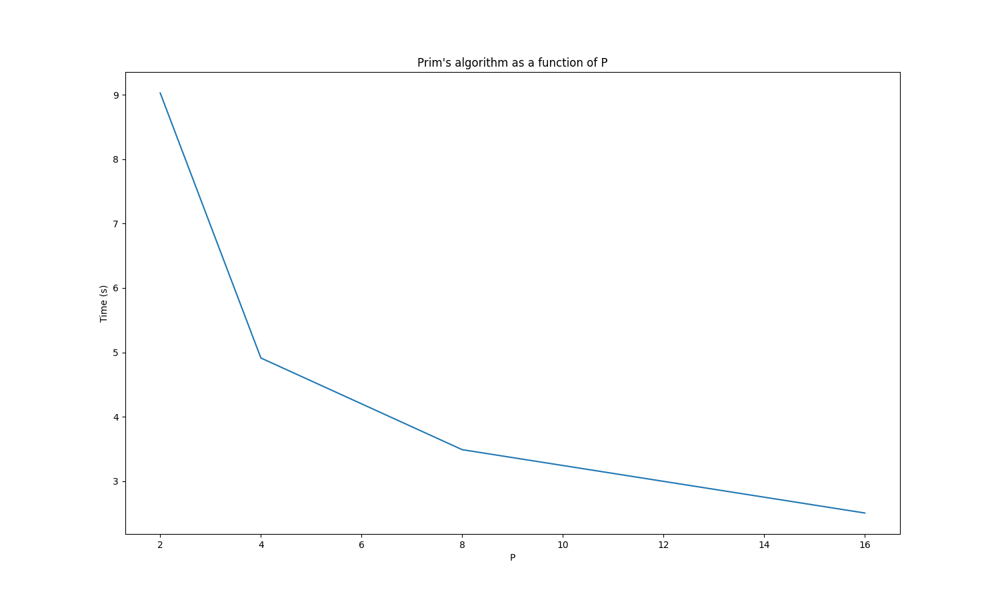
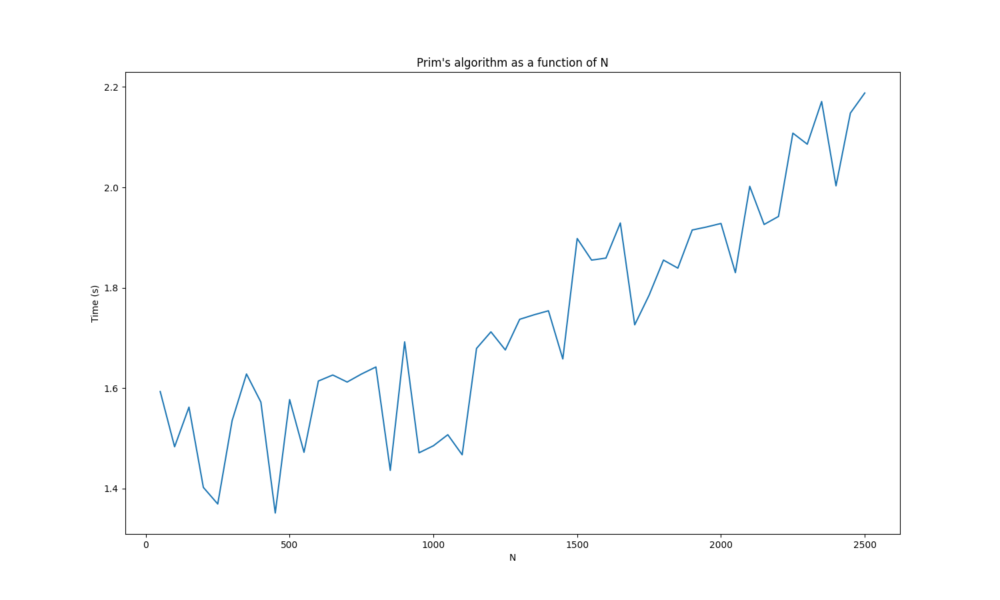
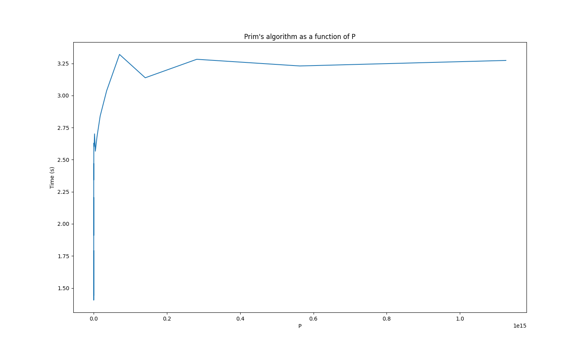

# Prim's algorithm

## Team

Dumitrache Adrian-George 342C1 \
Petrea Andrei 342C1

## Prerequisites

Run `make tests` to generate graph files in the `tests/` directory. The
generated graphs will have various sizes, densities and weight ranges to make
profiling the various implementations of Prim's algorithm using different types
of graphs easier.

Run `make` to compile all the implementations of Prim's algorithm. You can test
the implementations by running the executables in the `bin/` directory and giving
them the path to a graph file as an argument.

e.g: `./bin/serial_prim tests/huge_graph.txt`.

Note: the following results were retrieved locally on a machine with 8 physical
core (16 logical cores) and then tested for validation on the fep cluster.

## Test graphs features

The following table describes the features of the test graphs:

| Graph file | Number of vertices | Sparseness factor | Weight range |
|------------|--------------------|-------------------|--------------|
| small_graph.txt | 25 | 0.3 | 1-100 |
| medium_graph.txt | 300 | 0.3 | 1-100 |
| large_graph.txt | 750 | 0.3 | 1-100 |
| huge_graph.txt | 10000 | 0.3 | 1-100 |
| dense_graph.txt | 10000 | 0.85 | 1-100 |
| sparse_graph.txt | 10000 | 0.05 | 1-100 |
| large_weights_graph.txt | 10000 | 0.3 | 100-1000 |
| small_weights_graph.txt | 10000 | 0.3 | 1-10 |

Note: Sparseness factor is defined as the probability of an edge existing between two vertices.

## Serial implementation of Prim's algorithm





The previous charts confirm the following:

* vertex count has a big impact on the performance of the algorithm
* graph density has a big impact on the performance of the algorithm
* weights do not influence the performance of the algorithm at all

This is mostly already know from the algorithm's complexity: O((V + E) log V)


We will now continue to use Intel VTune to analyze the performance hotspots
that the algorithm has when ran on the sparse and dense graphs:




As seen in the previous flame graphs, the difference in total time between
graphs of different densities comes from set find operations, so the following
code is the culprit:

```cpp
for (auto [neighbour, weight] : adj[node]) {
    if (visited.find(neighbour) == visited.end() && dist[neighbour] > weight) {
        dist[neighbour] = weight;
        parent[neighbour] = node;

        pq.push({neighbour, dist[neighbour]});
    }
}
```

Thankfully, this sequence is fairly easy to parallelize.

However, sparse graphs would benefit more from performance improvements to the
first IO sequence that gets the graph into memory, as most of the time is spent
on those operations.

## Pthreads implementation of Prim's algorithm

### Prim optimization

A naive parallelization of the hotspot found earlier in Prim's algorithm would
be to start a new series of threads for each step of the algorithm. This works
in theory, assuming that starting new threads is free in terms of computation;
which is completely untrue. Systems with few cores might not feel this problem
as much (such as the 4 core Xeon on fep), but systems with large amounts of cores
will definitely feel held back.

This idea can be seen in action in `failed_pthreads_prim.cpp`, we don't need
an advanced tool like VTune to discover its shortcomings, `time` will do just
fine (tested on a system with 16 logical cores):

```bash
time ./serial_prim tests/dense_graph.txt

real    0m9,056s
user    0m8,556s
sys     0m0,494s
```

```bash
time ./failed_pthreads_prim tests/dense_graph.txt

real    0m10,604s
user    0m7,777s
sys     0m7,413s
```

As we can see, our attempt at parallelization wastes a lot of time in sys mode
setting up threads, leading to a mostly similar/slightly worse runtime.

A better idea would be a thread pool approach, which starts threads only
once and has them wait for new tasks, completely avoiding the operating system
overhead. This idea is implemented in `pthreads_prim.cpp` and the results are
promising:

```bash
time ./pthreads_prim tests/dense_graph.txt

real    0m6,070s
user    0m11,740s
sys     0m4,207s
```

This speedup of ~1.5x is not the theoretical maximum according to Amdahl's law,
but it is close enough considering the high amount of synchronization needed
for the thread pool implementation to work correctly.

We've been focusing exclusively on dense graphs so far, as the current
optimization targets them directly. This optimization does not have a big
impact on sparse graphs, in fact, it might even slow them down due to the
extra synchronization overhead.

Because of this, the algorithm has been designed to parallelize the array
operation based on the size of the adjacency list and the size of the cache
line. This allows the algorithm to decide to not parallelize the operation if
the adjacency list is small enough to fit in the cache line, as it would bring
no benefit.

### IO optimization

The second optimization is to parallelize the IO sequence that reads the graph
from the input file. Again, a naive approach would be to separate the file
into chunks and have each thread read their own chunk and parse it.
Unfortunately, this doesn't really help the bottleneck of disk IO, as threads
cannot actually read the same file from disk without exclusive access to it
(issues with the file offset for example). And even with exclusive access,
it's probably more efficient to read the file sequentially due to caching.

Our solution is to have the main thread read the file and parse it, while
periodically sending tasks to the thread pool to process the data. This way,
the IO thread is not blocked by the processing of the data and can continue
reading the file while the data is being processed by other threads.

Here are some preliminary results for the IO optimization on a sparse graph:

```bash
# Serial time on a sparse graph to compare with
time ./serial_prim tests/sparse_graph.txt

real    0m7,386s
user    0m7,300s
sys     0m0,085s
```

```bash
# Parallel time on a sparse graph
time ./pthreads_prim tests/sparse_graph.txt

real    0m1,586s
user    0m10,716s
sys     0m2,275s
```

And here are the results for the IO optimization on a dense graph:

```bash
# Parallel time on a dense graph
time ./pthreads_prim tests/dense_graph.txt

real    0m2,251s
user    0m16,622s
sys     0m2,615s
```

This improvement is significant, especially on sparse graphs, where the IO
operations were the main bottleneck.

The final **speedup** is around ~5 and an **efficiency** of ~0.4, a great result.

### Conclusion

Here is how the final algorithm evolves based on N (random spikes probably due
to unpredictable scheduling):



And based on P:



Notice that the change from 8 to 16 threads is not as significant, showing that
the algorithm starts to plateau in terms of speedup.

## OpenMP implementation of Prim's algorithm

The OpenMP implementation of Prim's algorithm is similar to the pthreads one,
using the framework's thread pool equivalent (tasks) to parallelize the
algorithm, resulting in a **speedup** of ~5 and an **efficiency** of ~0.4.

### Results

The results are, for the most part, similar to the pthreads implementation.
The slightly higher time is probably due to OpenMP's overhead.






## MPI implementation of Prim's algorithm

This version tries to parallelize the same inner loop as the previous versions,
by distibuting the entire adjacency list to all processes and having them
process a part of it.

Unfortunately, this approach requires a lot of communication between processes,
more specifically, the master process has to scatter an adjacency list during
each step of the main loop, and gather the results from all processes. This
leads to less than ideal results, which can be seen in the following chart:



As we can see, the MPI implementation is significantly slower than the other
variants. Other methods, such as transferring the entire graph to all processes
does not improve the performance either.

## Hybrid MPI/OpenMP implementation of Prim's algorithm

This version introduces threading to each MPI process, allowing them to
parallelize the processing of their parts of the adjacency list. As well as
using a similar IO optimization as the pthreads and OpenMP versions.

The results are still fairly disappointing, cementing the idea that the
communication overhead is too high for this type of algorithm to be run
efficiently in a distributed environment.


